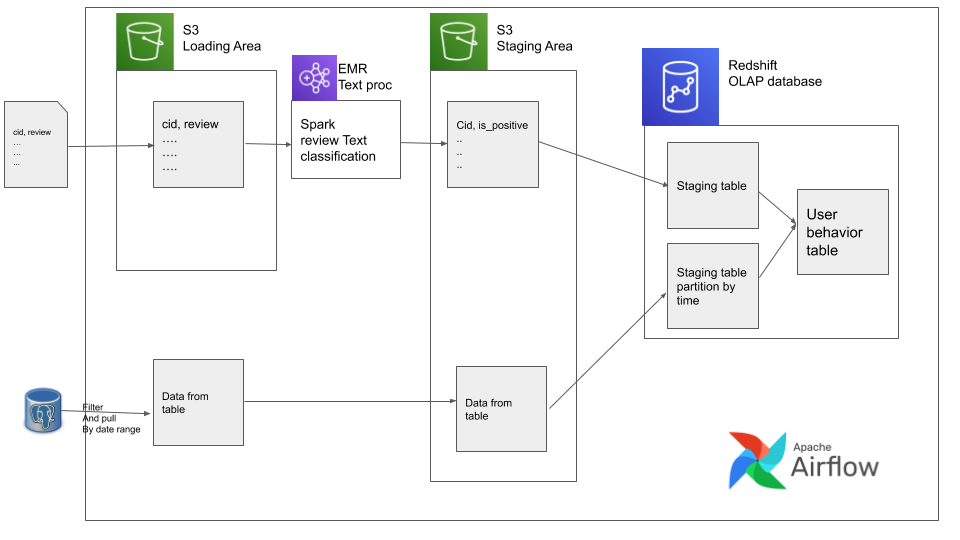
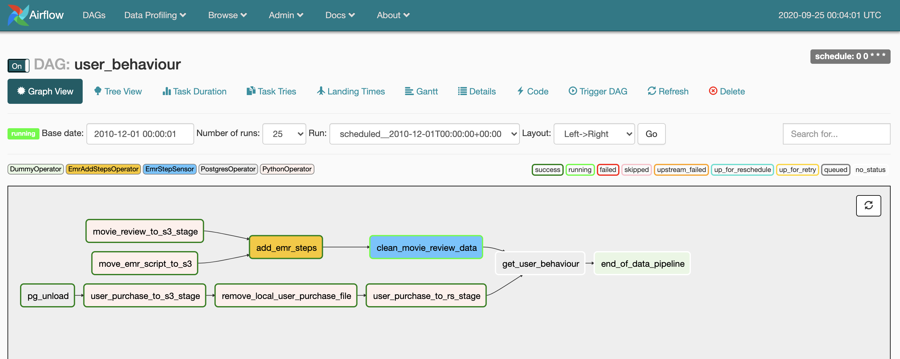

# DE Project

## Tasks

- load user purchase data into postgresql db and get filtered data into local file

- deploy file onto S3 and remove local file

- load review data in S3, also load spark script in S3

- add EMR steps to EMR cluster

- sense the completion of the last step

- calculate statistics about user behavior within Redshift and get the output

## Prereq

1. [docker](https://docs.docker.com/get-docker/) (also make sure you have `docker-compose`) we will use this to run Airflow locally
2. [pgcli](https://github.com/dbcli/pgcli) to connect to the databases(postgres and Redshift)


1. `aws cli` configured with keys and region
2. `pem or ppk` file saved locally with correct permissions
3. `ARN` from your `iam` role for Redshift
4. `S3` bucket
5. `EMR ID` from the summary page
6. `Redshift` host, port, database, username, password

## Design



## Data

Data is available at [data](https://www.dropbox.com/sh/amdyc6z8744hrl5/AAC2Fnbzb_nLhdT2nGjL7-7ta?dl=0).Place this folder within the `setup` folder as such `setup/raw_input_data/`

## Setup and run

### local

In you local terminal type within your project base directory

```bash
docker-compose -f docker-compose-LocalExecutor.yml up -d
```

Then wait a couple seconds and sign into the Airflow `postgres` metadata database(since our data is small we pretend that our metadata database is also our OLTP datastore)

```bash
pgcli -h localhost -p 5432 -U airflow
```

and run the script at `setup/postgres/create_user_purchase.sql`.

### Redshift

log into redshift using `pgcli`

```bash
pgcli -h <your-redshift-host> -p 5439 -d <your-database> -U <your-redshift-user>
# type password when prompted
```

In the redshift connection create tables as `setup/redshift/create_external_schema.sql`.

log on to [www.localhost:8080](http://localhost:8080) to see the Airflow UI

**Create a new connection 'redshift_conn'**


### EMR

switch on your `DAG`, after running successfully, verify the presence of data in redshift using
`select * from  public.user_behavior_metric limit 10;`.

## Workflow



## Stop

From your AWS console, stop the redshift cluster and EMR cluster
In you local terminal type within your project base directory
```bash
docker-compose -f docker-compose-LocalExecutor.yml down
```
## Some note

*Remember to create schema and tables in PostgreSQL in advance before run the first task*

*Remember to create all the tables that are needed in Redshift (after connecting)*

*Remember to set proper EMR master node inbound rules*
